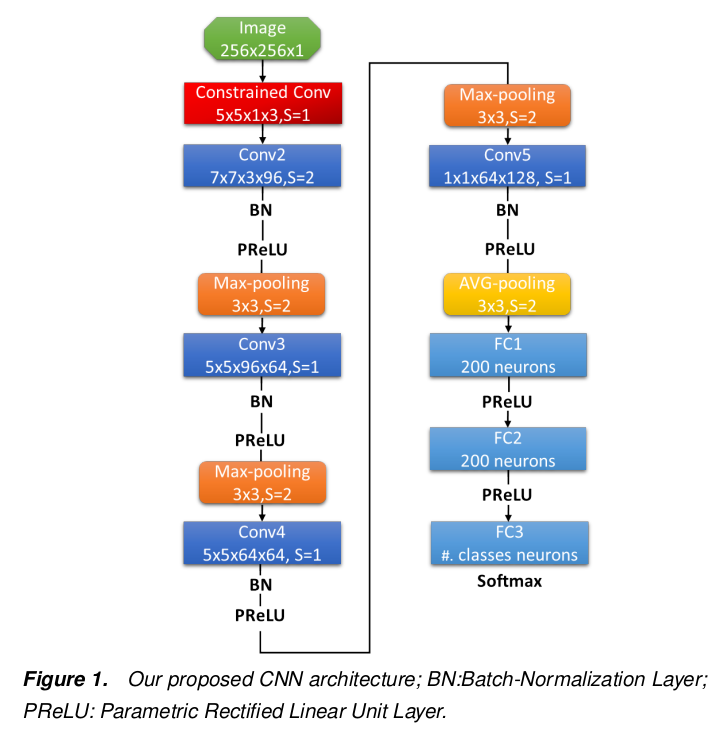
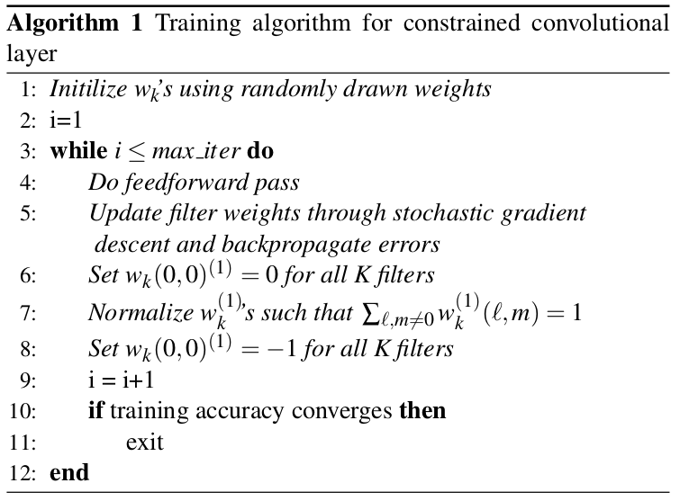

# CamModel
Research Project of CNN-based Camera Model Identification

## Download Dresden Database
1. see if the data path already exist
2. if not, then make a new one, if yes just download the database
3. download urls are read from the dresden.csv

For this experiment, I only use the brand **Afga** and **Canon**.
- Afga: DC-504(169), DC-733S(281), DC-830I(363), 505-X(172), 530S(372)
- Canon: IXUS 55(224), IXUS 70(567), A640(188)

In totoal, there are 2336 images.

## Extract Patches
each model has at least 150 images
1. randomly select 80% of the database
2. divide these images in to 256 x 256 pixel patches
3. retain the central 25 patches from the green layer of each image for training databse

## Data preparation
Format the images into appropriately pre-processed floating point tensors before feeding to the network:
1. Read images from the disk.
2. Decode contents of these images and convert it into proper grid format as per their RGB content.
3. Convert them into floating point tensors.
4. Rescale the tensors from values between 0 and 255 to values between 0 and 1, as **neural networks prefer to deal with small input values.**

## Construct the Network

### Constrained Convolution Layer

CNNs in their existing form do not suppress the image’s content and may lead to a classifier that identifies the scenes and objects associated with training data.

The constrained convolutional layer which can jointly suppress an image’s content and adaptively learn pixel values dependencies while training CNN to perform universal image manipulation detection.

Each of the $K$ filters $w_k$ in the first convolutional layer of the CNN have the following constraints placed on them:

$$\begin{cases}
  w_k^{(1)}(0, 0) = -1\\    
  \sum_{l,m \neq 0} w_k^{(1)}(l, m) = 1
\end{cases}$$

We enforce the first convolutional layer in CNN to extract prediction-error features by learning a normalized linear combination of the central pixel value in terms of its local
neighbors within the convolutional filter dimension.

Additionally, while training CNNs, their testing accuracies on a separate testing
database were recorded every 1000 iterations to produce figures in the experiments sections.

### Training

The batch size equal to 64 and the parameters of the stochastic gradient descent as follows:
$momentum = 0.9$, $decay = 0.0005$, and a $learning rate ε = 10^{−3}$ that decreases every 5 epochs by a factor $γ = 0.5$. We trained the CNN in each experiment for 45 epochs (approximately 1642 iterations).

## Next Step

Test the robustness of our model (trained on Canon)

- train the model on **Canon_Ixus70**, **Nikon_D200**, **Olympus_MJU** because they share the similar images' scenes, make the number of traing images of each camera close.

- plot the mean confidence of each classification

### Robustness to Different makes

We want to see whether our model simply see them as a unknown data or classifies them to one of the known categories.

Test the model on 
- Canon_Ixus55(same brand, same content)
- Nikon_D70(same brand, same content)
- Canon_Powershot64(same brand, different content)
- Agfa_DC-830i(different brand, same content)
- Sony_W170(different brand, different content)

### Robustness to Post-processing 

- JPEG compression
- Gaussian Noise 
- Gaussian Blur.

### Robustness to Different Instances

Train model on only one instance, test it with other instances.
